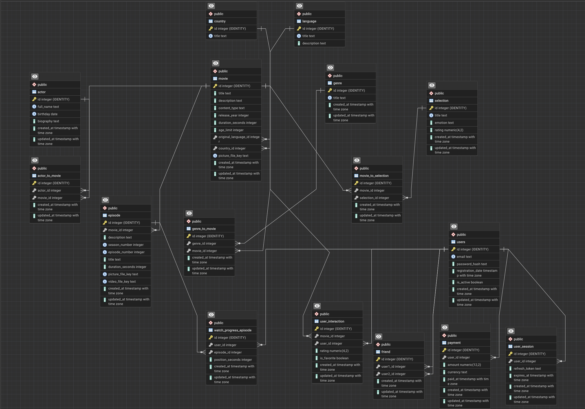

# Нормализованные отношения (ДЗ1) для сервиса Vkino

## Общие принципы нормализации в данной схеме

- Все атрибуты атомарны (нет `json`, `array`, составных полей) - **1НФ**.
- Связи многие-ко-многим вынесены в отдельные отношения (`genre_to_movie`, `actor_to_movie`, `movie_to_selection`) - это помогает избежать повторов и частичных зависимостей.
- Справочники (`genre`, `language`, `country`) вынесены отдельно, а в сущностях используются внешние ключи - это устраняет транзитивные зависимости и поддерживает **3НФ/НФБК**.
- Для большинства отношений детерминантами ФЗ являются ключи (первичные или альтернативные уникальные) - это соответствует **НФБК**.

---

Ниже приведено описание таблиц:

### `genre`
Справочник жанров контента. Хранит уникальные названия жанров, которые затем связываются с фильмами и сериалами через таблицу связи. Наличие отдельного справочника исключает дублирование строковых значений жанров в карточках контента.

### `language`
Справочник языков, используемый для указания оригинального языка контента (и потенциально для расширения под озвучки/дорожки в будущем). Хранит название языка и опциональное описание.

### `country`
Справочник стран производства контента. Используется как внешний ключ в таблице `movie`, чтобы не хранить страны в виде произвольного текста и не допускать дублей/разных написаний.

### `movie`
Основная сущность контента (собирательная карточка фильма или сериала), отображаемая в каталоге и на странице просмотра. Хранит название, описание, тип контента (`film` / `series`), год выхода, длительность, возрастное ограничение, ссылки на язык и страну, а также ключ файла обложки в S3-совместимом хранилище.

### `episode`
Эпизоды (серии), связанные с записью `movie` — в первую очередь для сериалов. Таблица хранит структуру сезонов и серий, отдельную длительность, описание, название, а также ключи изображения и видеофайла для конкретного эпизода.

### `actor`
Справочник актёров, переиспользуемый в разных единицах контента. Хранит ФИО, дату рождения (опционально), краткую биографию (опционально) и служебные поля времени.

### `genre_to_movie`
Связующая таблица для отношения многие-ко-многим между жанрами и контентом. Позволяет одному фильму/сериалу иметь несколько жанров, а одному жанру — относиться ко множеству единиц контента.

### `actor_to_movie`
Связующая таблица для отношения многие-ко-многим между актёрами и контентом. Используется для хранения состава актёров в фильмах/сериалах без дублирования данных об актёрах.

### `selection`
Подборки контента (например, тематические или рекомендательные списки). Хранит название подборки, опциональный тег/эмоцию и опциональный рейтинг подборки.

### `movie_to_selection`
Связующая таблица для отношения многие-ко-многим между контентом и подборками. Позволяет одному фильму/сериалу входить в несколько подборок, а одной подборке — содержать много единиц контента.

### `users`
Учётные записи пользователей сервиса. Хранит email, хеш пароля, дату регистрации, флаг активности и служебные поля времени для дальнейшей авторизации и персонализации.

### `user_interaction`
Таблица пользовательских взаимодействий с контентом. Содержит оценку пользователя и флаг избранного для пары (`user`, `movie`), что позволяет хранить пользовательские предпочтения отдельно от сущностей контента и аккаунта.

### `watch_progress_episode`
История/прогресс просмотра эпизодов пользователями. Используется для реализации сценария «продолжить просмотр» и хранит позицию остановки в секундах для пары (`user`, `episode`).

### `friend`
Социальные связи между пользователями. Таблица фиксирует пары друзей с ограничениями, исключающими связь пользователя с самим собой и дублирование одной и той же пары в разном порядке.

### `payment`
Платежи пользователей в сервисе. Хранит сумму, валюту, время оплаты и связь с пользователем; может использоваться для подписки, платного контента и дополнительных функций.

### `user_session`
Серверные пользовательские сессии (например, refresh token-сессии для авторизации). Хранит refresh token, срок действия и связь с пользователем, что позволяет контролировать сессии и отзывать их при необходимости.

---

## Краткое итоговое обоснование 1НФ, 2НФ, 3НФ и НФБК

### 1НФ
Все таблицы содержат атомарные атрибуты. Списки, наборы и множественные значения вынесены в отдельные отношения (таблицы-связки). Составные типы (`json`, `array`) не используются.

### 2НФ
Для таблиц с суррогатным PK (`id`) частичные зависимости невозможны. Для отношений с альтернативными составными ключами (`episode`, `*_to_*`, `user_interaction`, `watch_progress_episode`, `friend`) неключевые атрибуты зависят от полного составного ключа.

### 3НФ
Транзитивные зависимости устранены за счет вынесения справочников (`genre`, `language`, `country`) и сущностей в отдельные таблицы. В отношениях хранятся ссылки (FK), а не дублирующиеся атрибуты связанных сущностей.

### НФБК (BCNF)
Во всех перечисленных ФЗ детерминанты являются суперключами/ключами отношений (PK или альтернативными уникальными ключами). Следовательно, схема соответствует НФБК при принятых бизнес-ограничениях уникальности.
